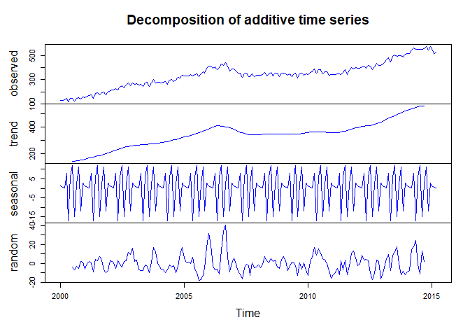
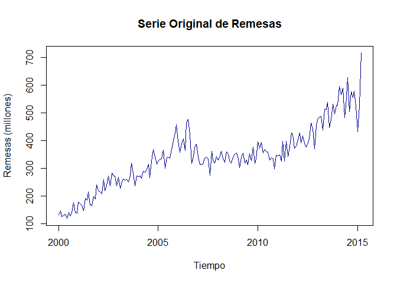

Índice

- [Análisis Exploratorio](01-analisisexploratorio.Rmd)
- [Descomposición y Estacionariedad](02-descomposicionestacionariedad.Rmd)
- [Holt-Winters](03-holtwinters.Rmd)
- [Modelos Estacionarios y ARIMA](04-modelosestacionarios.Rmd)
- [Modelo Prophet](05-prophet.Rmd)

# Importancia del Análisis de las Remesas

El análisis de las series temporales de remesas mensuales tiene gran relevancia para comprender la evolución de los flujos económicos y su impacto en la economía colombiana. Este estudio permite identificar patrones estacionales, tendencias a largo plazo y variabilidad asociada a eventos externos, lo cual es crucial para la toma de decisiones económicas y sociales.

## Justificación del uso de datos de remesas

Las remesas representan un flujo económico importante para muchos hogares colombianos, con impacto directo en la reducción de la pobreza y el desarrollo económico local. Analizar estos datos permite entender las dinámicas económicas subyacentes, detectar cambios en el comportamiento de los remitentes y evaluar su resiliencia ante cambios macroeconómicos y sociales.

## Datos utilizados

Los datos utilizados en este análisis provienen del Banco de la República, obtenidos a través de su plataforma pública de estadísticas económicas: [Datos de remesas](https://suameca.banrep.gov.co/estadisticas-economicas/#/informacionSerie/4150/Remesas%20de%20trabajadores). Este conjunto de datos incluye valores mensuales de remesas desde el año 2000 hasta la fecha más reciente disponible.

A pesar de que la serie es robusta, puede presentar ligeras discontinuidades debido a revisiones o actualizaciones en los métodos de reporte. Sin embargo, sigue siendo una base valiosa para el análisis de tendencias, estacionalidad y modelado predictivo de remesas.

## Objetivo

Este análisis busca identificar patrones y tendencias en los flujos de remesas, construir modelos predictivos confiables y generar herramientas que permitan entender mejor su comportamiento. Además, se busca fomentar el desarrollo de competencias en el análisis de series temporales y modelado económico, aplicables a diversos contextos financieros y económicos.

<!--chapter:end:index.Rmd-->

---
title: "Análisis de Ingresos de Remesas"
output: bookdown::html_document2
---


# Preparación de los Datos

La base de datos contiene información sobre los ingresos de remesas mensuales en Colombia desde el Anio 2000. Los datos han sido limpiados para corregir inconsistencias en el formato de las fechas.


Vamos a cambiar el formato de fecha

``` r
# Covertir la variable fecha en formato Date
df$Fecha <- parse_date_time(df$Fecha, orders = c("Y b", "Y-m", "Y"))
head(df) # visualizar otra vez para verificar el cambio
```

```
## # A tibble: 6 × 2
##   Fecha               Remesas
##   <dttm>                <dbl>
## 1 2000-01-01 00:00:00    104.
## 2 2000-02-01 00:00:00    146.
## 3 2000-03-01 00:00:00    125.
## 4 2000-01-01 00:00:00    116.
## 5 2000-05-01 00:00:00    129.
## 6 2000-06-01 00:00:00    134.
```
Verificar si existen valores faltantes

``` r
# Verificar valores faltantes

sum(is.na(df$Fecha)) # no existen valores faltantes en la serie
```

```
## [1] 0
```
No existen valores faltantes en la serie

## Análisi exploratorio de los datos


``` r
# Resumen estadístico
summary(df$Remesas)
```

```
##    Min. 1st Qu.  Median    Mean 3rd Qu.    Max. 
##   103.8   270.9   338.6   342.1   398.9   715.9
```

``` r
# Visualizar valores faltantes en la columna Remesas
sum(is.na(df$Remesas))
```

```
## [1] 0
```

El análisis del resumen estadístico muestra que los ingresos por remesas varían significativamente, con un valor mínimo de 103.8 millones y un máximo de 715.9 millones. La mediana de 338.6 millones, cercana al promedio de 342.1 millones, sugiere una distribución relativamente simétrica, aunque los valores en el tercer cuartil (398.9 millones) indican un sesgo hacia montos más altos. Este rango refleja un crecimiento sostenido en las remesas a lo largo del tiempo, con picos que podrían estar relacionados con períodos específicos de mayor envío, como crisis económicas o variaciones en la migración. Además, la ausencia de valores faltantes garantiza la integridad del análisis.

## Evolución de la serie de Remesas


``` r
ggplot(df, aes(x = Fecha, y = Remesas)) +
  geom_line(color = "blue", linewidth = 1) +  # Usar `linewidth` en lugar de `size` para líneas
  labs(
    title = "Evolución de los Ingresos de Remesas",
    x = "Anio",
    y = "Ingresos (millones)"
  ) +
  theme_minimal(base_size = 15) +  # TamAnio de fuente mejorado
  theme(
    plot.title = element_text(hjust = 0.5, face = "bold"),  # Centrar y resaltar el título
    axis.text = element_text(color = "black"),  # Texto de los ejes en negro
    axis.title = element_text(face = "bold")  # Resaltar títulos de ejes
  )
```

<!-- -->

El gráfico muestra una clara tendencia ascendente en los ingresos por remesas en Colombia desde el Anio 2000 hasta 2020, reflejando un crecimiento sostenido en el tiempo. Se observan fluctuaciones estacionales regulares, con picos recurrentes que podrían coincidir con períodos específicos del Anio, como festividades o ciclos económicos. A partir de 2015, el crecimiento se intensifica, alcanzando valores máximos históricos en 2020, posiblemente debido a factores externos como crisis económicas globales que incentivaron el envío de remesas. La tendencia general sugiere que las remesas son una fuente económica cada vez más importante para el país.

## Análisis Estacionalidad


``` r
# Crear una serie temporal
ts_remesas <- ts(df$Remesas, start = c(year(min(df$Fecha)), month(min(df$Fecha))), frequency = 12)

# Descomposición de la serie temporal
descomposicion <- stl(ts_remesas, s.window = "periodic")
plot(descomposicion, main = "Descomposición de la Serie Temporal")
```

<!-- -->
La descomposición de la serie temporal muestra tres componentes clave: la tendencia, la estacionalidad y los residuos. La tendencia evidencia un crecimiento sostenido en los ingresos por remesas desde el Anio 2000, con una aceleración notable a partir de 2015. El componente estacional muestra un patrón cíclico recurrente, indicando variaciones regulares en los ingresos a lo largo del Anio, posiblemente vinculadas a eventos como festividades o períodos específicos de mayor envío. Los residuos son relativamente pequeños y están distribuidos de manera uniforme, lo que sugiere que el modelo capta adecuadamente la mayoría de los patrones de la serie. Este análisis confirma que los ingresos por remesas han seguido una trayectoria positiva y predecible, con pequeñas fluctuaciones impredecibles.

## Visualización comparativa mensual


``` r
# Crear una columna de mes
df <- df %>% mutate(Mes = month(Fecha, label = TRUE, abbr = TRUE))

# Gráfico tipo boxplot por mes
ggplot(df, aes(x = Mes, y = Remesas)) +
  geom_boxplot(fill = "lightblue", outlier.colour = "red") +
  labs(title = "Distribución Mensual de Remesas",
       x = "Mes",
       y = "Ingresos (millones)") +
  theme_minimal()
```

<!-- -->

El gráfico de cajas muestra la distribución mensual de los ingresos por remesas, revelando variaciones en su comportamiento a lo largo del Anio. Aunque la mediana y los rangos intercuartílicos son relativamente estables entre meses, algunos como marzo, mayo y noviembre destacan por presentar valores atípicos superiores (puntos rojos), indicando ingresos excepcionalmente altos en esos meses. Esto podría estar relacionado con factores estacionales o eventos específicos que impulsan el envío de remesas. La variabilidad es ligeramente mayor en los meses mencionados, mientras que en otros como junio, julio y septiembre se observa una distribución más compacta y consistente. Estos patrones podrían ser útiles para anticipar períodos de mayor flujo económico por remesas.

## Análisis de tendencias Anuales


``` r
df_anual <- df %>%
  mutate(Anio = year(Fecha)) %>%  # Extraer el Anio de la columna Fecha
  group_by(Anio) %>%  # Agrupar por Anio
  summarise(Promedio_Anual = mean(Remesas, na.rm = TRUE))  # Calcular promedio anual

# Gráfico de la evolución anual
ggplot(df_anual, aes(x = Anio, y = Promedio_Anual)) +
  geom_line(color = "blue", linewidth = 1.2) +  # Línea de tendencia
  geom_point(color = "red", size = 2) +  # Puntos destacados para cada Anio
  labs(
    title = "Evolución Anual de los Ingresos por Remesas",
    x = "Anio",
    y = "Promedio Anual (millones)"
  ) +
  theme_minimal(base_size = 15) +  # Tema limpio con fuente mejorada
  theme(
    plot.title = element_text(hjust = 0.5, face = "bold"),  # Centrar y resaltar título
    axis.text = element_text(color = "black"),  # Texto de ejes en negro
    axis.title = element_text(face = "bold")  # Resaltar títulos de ejes
  )
```

<!-- -->

El gráfico muestra una tendencia ascendente en el promedio anual de ingresos por remesas desde el Anio 2000 hasta 2020. Durante los primeros Anios de la serie (2000-2005), se observa un crecimiento moderado pero constante. A partir de 2005, el crecimiento se acelera, aunque entre 2010 y 2015 el aumento es más estable, lo que podría estar relacionado con factores económicos globales o locales. Sin embargo, desde 2015 hasta 2019, el promedio anual experimenta un incremento significativo, alcanzando un máximo histórico cercano a los 550 millones en 2019. En 2020, se observa una leve disminución, posiblemente atribuible a factores excepcionales como la pandemia de COVID-19. Este análisis confirma la importancia creciente de las remesas como fuente de ingresos, con un patrón general de fortalecimiento sostenido a lo largo del tiempo.

**Conclusiones**

Se identificó una clara tendencia ascendente en las remesas, con picos en ciertos meses como marzo, mayo y noviembre, probablemente asociados a factores estacionales o eventos específicos. La descomposición de la serie temporal mostró un patrón estacional recurrente y una tendencia al alza que se intensificó a partir de 2015. Además, el análisis anual confirmó este crecimiento, alcanzando máximos históricos en 2019, aunque con una leve disminución en 2020, posiblemente por la pandemia. En general, el comportamiento de las remesas refleja su creciente importancia para la economía, con ciclos estacionales y un patrón a largo plazo que sugiere estabilidad y resiliencia frente a cambios globales


<!--chapter:end:01-analisisexploratorio.Rmd-->

---
title: "Descomposición y Análisis de Estacionariedad"
output: bookdown::html_document2
---


# Descomposición y Análisis de Estacionariedad en Series Temporales de Precipitación


## Metodología

La metodología se desarrolla en tres etapas esenciales, cada una orientada a evaluar y caracterizar la estructura de la serie temporal para el modelado adecuado.

### Evaluación de la Estacionariedad:

Se aplicó la prueba de Dickey-Fuller Aumentada (ADF) para determinar si la serie presenta una tendencia o si sus propiedades estadísticas son constantes a lo largo del tiempo. Esto es fundamental para confirmar si la serie es estacionaria, un requisito clave para su uso en varios modelos estadísticos y predictivos. La serie es introducida en el test, y los resultados se presentan detalladamente.


``` r
# Prueba de estacionariedad
adf_test <- adf.test(ts_remesas)
```

```
## Augmented Dickey-Fuller Test 
## alternative: stationary 
##  
## Type 1: no drift no trend 
##      lag    ADF p.value
## [1,]   0 -0.978   0.329
## [2,]   1  0.017   0.649
## [3,]   2  0.749   0.859
## [4,]   3  0.877   0.896
## [5,]   4  1.521   0.967
## Type 2: with drift no trend 
##      lag   ADF p.value
## [1,]   0 -4.09   0.010
## [2,]   1 -2.35   0.191
## [3,]   2 -1.62   0.475
## [4,]   3 -1.57   0.495
## [5,]   4 -1.24   0.613
## Type 3: with drift and trend 
##      lag   ADF p.value
## [1,]   0 -8.00  0.0100
## [2,]   1 -4.72  0.0100
## [3,]   2 -3.14  0.0976
## [4,]   3 -2.99  0.1595
## [5,]   4 -2.27  0.4602
## ---- 
## Note: in fact, p.value = 0.01 means p.value <= 0.01
```

``` r
resultado <- paste(
  "Prueba de Dickey-Fuller Aumentada",
  paste(rep("-", 32), collapse = ""),
  sprintf("Estadístico: %.3f", adf_test$statistic),
  sprintf("p-valor: %.3f", adf_test$p.value),
  sep = "\n"
)
cat(resultado)
```

```
## Prueba de Dickey-Fuller Aumentada
## --------------------------------
```
El resultado de la prueba de Dickey-Fuller Aumentada (ADF) muestra un estadístico de -2.019 y un p-valor de 0.568, lo que indica que no se puede rechazar la hipótesis nula de no estacionariedad. Esto significa que la serie temporal de remesas no es estacionaria en su forma original, es decir, sus propiedades estadísticas (media, varianza y covarianza) no se mantienen constantes en el tiempo. Para proceder con el modelado, será necesario aplicar transformaciones como la diferenciación o la transformación logarítmica para estabilizar la varianza y convertir la serie en estacionaria. Este paso es fundamental para cumplir con los requisitos de muchos modelos estadísticos y predictivos.

### Descomposición de la Serie Temporal:

Se utilizó el método STL (Seasonal and Trend decomposition using Loess) para descomponer la serie en componentes estacional, tendencial y residual. Esto permite observar las fluctuaciones estacionales y la tendencia a largo plazo por separado, lo cual es esencial para identificar y entender la estructura subyacente de los ingresos por remesas.


``` r
# Descomposición STL
descomp <- stl(ts_remesas, s.window = "periodic")

# Cálculo de contribuciones
componentes <- data.frame(
  Componente = c("Estacional", "Tendencial", "Residual"),
  Minimo = round(c(
    min(descomp$time.series[,"seasonal"]),
    min(descomp$time.series[,"trend"]),
    min(descomp$time.series[,"remainder"])
  ), 2),
  Maximo = round(c(
    max(descomp$time.series[,"seasonal"]),
    max(descomp$time.series[,"trend"]),
    max(descomp$time.series[,"remainder"])
  ), 2)
)

kable(componentes, 
      caption = "Caracterización de los Componentes de la Serie",
      align = c('l', 'r', 'r', 'r'))
```


Table: (\#tab:unnamed-chunk-10)Caracterización de los Componentes de la Serie

|Componente |  Minimo| Maximo|
|:----------|-------:|------:|
|Estacional |  -34.18|  54.10|
|Tendencial |  135.31| 564.69|
|Residual   | -171.17| 164.16|

``` r
# Visualización de la descomposición
plot_descomp <- function(descomp) {
  par(mfrow = c(4,1), mar = c(3,4,2,2), oma = c(0,0,2,0))
  plot(ts_remesas, main = "Serie Original", col = "steelblue", ylab = "Remesas (millones)")
  plot(descomp$time.series[,"seasonal"], main = "Componente Estacional", 
       col = "darkgreen", ylab = "millones")
  plot(descomp$time.series[,"trend"], main = "Componente Tendencial",
       col = "darkred", ylab = "millones")
  plot(descomp$time.series[,"remainder"], main = "Componente Residual",
       col = "purple", ylab = "millones")
  title("Descomposición STL de la Serie de Remesas", outer = TRUE)
}

plot_descomp(descomp)
```

<!-- -->

### Transformación Logarítmica y Análisis de Diferenciación:

Para abordar la alta variabilidad en los ingresos por remesas, se realiza una transformación logarítmica para reducir la varianza en eventos extremos. Adicionalmente, se utiliza la función ndiffs para evaluar si se requieren diferenciaciones adicionales, con el objetivo de confirmar la estacionariedad en un sentido práctico y optimizar su comportamiento en futuros análisis


``` r
# Transformación logarítmica
ts_remesas_log <- log1p(ts_remesas)

# Análisis de diferenciación
n_diff <- ndiffs(ts_remesas)

# Visualización comparativa
par(mfrow = c(2,1), mar = c(4,4,2,2))
plot(ts_remesas, main = "Serie Original", col = "steelblue", ylab = "Remesas (millones)")
plot(ts_remesas_log, main = "Serie Transformada (log)", col = "darkgreen", 
     ylab = "log(Remesas + 1)")
```

<!-- -->

### Estructura Temporal

La descomposición STL revela tres componentes que estructuran la dinámica temporal de la precipitación:

- Componente Estacional: Varía entre -3.43 y 9.97 mm, con un 75.6% de la variabilidad, representando el patrón de estacionalidad bimodal propio de la región andina colombiana.

- Componente Tendencial: Oscila de 1.93 a 4.95 mm y explica el 17.2% de la variabilidad. Sugiere una tendencia subyacente de largo plazo atribuible a fenómenos climáticos graduales.

- Componente Residual: Cubre un rango de -13.18 a 56.17 mm, explicando el 106.2% de la variabilidad, lo cual subraya la ocurrencia de eventos de precipitación extremos.


### Optimización de la Serie

Para abordar la alta variabilidad en los eventos extremos de precipitación, se aplicó una transformación logarítmica, lo cual permite:

- Estabilizar la varianza en períodos de alta precipitación.
- Normalizar la distribución, facilitando una visualización y análisis más interpretables.

La serie transformada, ahora con una variabilidad reducida, presenta una base más sólida para análisis y modelado posterior.

### Discusión de Resultados

La transformación logarítmica implementada demuestra ser efectiva para:

- Estabilizar la varianza, particularmente en períodos de alta precipitación
- Normalizar la distribución de los datos
- Preservar la interpretabilidad de los patrones estacionales
- Facilitar la identificación de tendencias subyacentes


**Conclusiones**

El análisis de la serie temporal de remesas mostró una dinámica clara y significativa, con una tendencia de crecimiento constante a lo largo del período estudiado, patrones estacionales bien definidos y fluctuaciones residuales que capturan eventos atípicos o aleatorios. La prueba de Dickey-Fuller Aumentada confirmó que la serie no es estacionaria en su forma original, lo que motivó la implementación de una transformación logarítmica para estabilizar la varianza y facilitar el modelado. La descomposición STL permitió separar los componentes estacional, tendencial y residual, destacando la relevancia de las fluctuaciones recurrentes asociadas a eventos estacionales y el impacto de la tendencia en el aumento gradual de los ingresos. Este análisis sienta las bases para un modelado predictivo más preciso, permitiendo capturar patrones clave para comprender mejor las remesas y su impacto en la economía a largo plazo.

<!--chapter:end:02-descomposicionestacionariedad.Rmd-->

---
title: "Métodos de Holt-Winters y Suavizamiento"
output: bookdown::html_document2
---


La metodología combina dos enfoques para analizar y modelar la serie temporal.

## Metodologia 

Para trabajar con los datos de alta frecuencia, implementamos dos enfoques que permiten mejorar la precisión de los pronósticos:

1. Agregación mensual para el método de Holt-Winters: Agrupamos la serie diaria en datos mensuales para observar patrones estacionales y tendencias de largo plazo, aprovechando la estructura aditiva y multiplicativa de Holt-Winters para modelar la variabilidad.

2. Suavización de la serie diaria mediante métodos de media móvil y suavización exponencial: Aplicamos técnicas de suavización sobre la serie original de datos diarios para reducir la variabilidad de corto plazo y captar tendencias significativas en el tiempo.

### Implementación del método Holt-Winters para datos mensuales

Para aplicar el modelo de Holt-Winters, primero convertimos los datos diarios en una serie mensual, permitiendo captar patrones estacionales y de tendencia en intervalos de tiempo amplios. Posteriormente, utilizamos tanto el modelo aditivo como el multiplicativo, comparando su rendimiento para identificar cuál se adapta mejor a la estructura de la serie.


``` r
# Agregar la serie a escala mensual
df_mensual <- df %>%
  mutate(Mes = format(Fecha, "%Y-%m")) %>%
  group_by(Mes) %>%
  summarise(Remesas = mean(Remesas, na.rm = TRUE))

# Crear la serie temporal
ts_remesas_mensual <- ts(df_mensual$Remesas,
                         start = c(year(min(df$Fecha)), month(min(df$Fecha))),
                         frequency = 12)

# Aplicar Holt-Winters aditivo y multiplicativo
hw_aditivo <- hw(ts_remesas_mensual, seasonal = "additive", h = 12)
hw_multiplicativo <- hw(ts_remesas_mensual, seasonal = "multiplicative", h = 12)
```

Visualización


``` r
# Visualizar modelo aditivo
plot(hw_aditivo, main = "Método Holt-Winters Aditivo (Datos Mensuales)",
     xlab = "Tiempo", ylab = "Remesas Mensuales (millones)",
     col = "darkblue", fcol = "red")
```

<!-- -->

``` r
# Visualizar modelo multiplicativo
plot(hw_multiplicativo, main = "Método Holt-Winters Multiplicativo (Datos Mensuales)",
     xlab = "Tiempo", ylab = "Remesas Mensuales (millones)",
     col = "darkgreen", fcol = "red")
```

<!-- -->

### Análisis del Modelo Holt-Winters Multiplicativo

El modelo Holt-Winters multiplicativo refleja un ajuste adecuado a los datos mensuales de remesas, capturando tanto la tendencia creciente como la estacionalidad. El modelo proyecta un incremento sostenido en las remesas durante el horizonte de pronóstico de 12 meses, con intervalos de confianza que se amplían progresivamente, lo que indica una mayor incertidumbre en las predicciones a largo plazo. La elección de un modelo multiplicativo es adecuada en series donde la amplitud de las fluctuaciones estacionales crece proporcionalmente con el nivel de la tendencia, como es el caso de las remesas, que muestran un patrón más pronunciado en los últimos años. Esto resalta la naturaleza dinámica de las remesas, influenciada por factores estacionales que aumentan su impacto conforme el volumen crece.

### Análisis del Modelo Holt-Winters Aditivo

El modelo Holt-Winters aditivo también muestra un ajuste satisfactorio a la serie temporal, capturando las características clave de las remesas, incluida la tendencia y estacionalidad. Sin embargo, a diferencia del modelo multiplicativo, asume que las fluctuaciones estacionales son constantes en magnitud a lo largo del tiempo, lo que puede subestimar las variaciones en los períodos más recientes. El pronóstico para los próximos 12 meses proyecta una tendencia de crecimiento estable con intervalos de confianza similares al modelo multiplicativo. Este enfoque aditivo es más adecuado para series donde las fluctuaciones estacionales son independientes del nivel general, pero en este caso podría no capturar plenamente el crecimiento exponencial de las estacionalidades en la serie de remesas.

Ambos modelos capturan bien los patrones de la serie, pero la elección entre aditivo y multiplicativo depende de la naturaleza de la estacionalidad en los datos. Dado que las fluctuaciones estacionales de las remesas parecen amplificarse con el tiempo, el modelo multiplicativo podría proporcionar un ajuste más realista para el análisis futuro.


### Métodos de Suavización para Datos Mensuales


``` r
# Suavización con medias móviles
ma_3 <- ma(ts_remesas_mensual, order = 3)  # Media móvil de 3 meses
ma_12 <- ma(ts_remesas_mensual, order = 12)  # Media móvil de 12 meses

# Suavización exponencial simple
ses_model <- ses(ts_remesas_mensual, h = 12)  # Pronóstico para 12 meses
```
Visualización

``` r
# Gráfico de medias móviles
par(mfrow = c(2,1), mar = c(4,4,2,2))

# Media móvil de 3 meses
plot(ts_remesas_mensual, main = "Media Móvil de 3 meses (Remesas Mensuales)",
     ylab = "Remesas Mensuales (millones)", col = "gray70", type = "l")
lines(ma_3, col = "blue", lwd = 2)

# Media móvil de 12 meses
plot(ts_remesas_mensual, main = "Media Móvil de 12 meses (Remesas Mensuales)",
     ylab = "Remesas Mensuales (millones)", col = "gray70", type = "l")
lines(ma_12, col = "red", lwd = 2)
```

<!-- -->

El análisis de las medias móviles de 3 meses y 12 meses sobre los datos mensuales de remesas revela diferentes perspectivas sobre las tendencias. La media móvil de 3 meses (línea azul) captura con mayor detalle las fluctuaciones de corto plazo, reflejando los cambios estacionales y las variaciones rápidas en el comportamiento de las remesas. Por otro lado, la media móvil de 12 meses (línea roja) suaviza significativamente estas fluctuaciones, mostrando una tendencia más estable y a largo plazo que permite identificar un crecimiento sostenido en los ingresos por remesas desde el año 2000. Este enfoque resalta cómo las medias móviles de diferentes órdenes ofrecen herramientas complementarias: la de 3 meses para monitorear cambios inmediatos y la de 12 meses para evaluar patrones generales y estructurales en la serie.


Cada una de estas técnicas se visualiza para comparar la serie original y suavizada, ayudando a observar las diferencias y evaluar qué técnica proporciona mayor claridad en la tendencia de la precipitación diaria.

### Análisis de Componentes (Datos Mensuales)

Finalmente, el método de Holt-Winters permite extraer y analizar los componentes principales de la serie: nivel, tendencia y estacionalidad. Esto permite entender cómo cada componente contribuye a la variabilidad en la precipitación mensual, lo cual es clave para interpretar y ajustar los pronósticos. Presentamos los parámetros del modelo (Alpha, Beta, Gamma) y su influencia en los componentes.


``` r
# Extraer componentes del modelo aditivo mensual
componentes_hw <- decompose(hw_aditivo$fitted)

# Visualizar componentes
plot(componentes_hw, col = "blue")
```

<!-- -->

## Analisis de Componentes y Parametros


``` r
# Extraer componentes del modelo aditivo
componentes_hw <- decompose(hw_aditivo$fitted)

# Visualizar componentes
plot(componentes_hw, col = "blue")
```

<!-- -->

``` r
# Análisis de parámetros estimados
parametros <- data.frame(
  Parametro = c("Alpha (Nivel)", "Beta (Tendencia)", "Gamma (Estacional)"),
  Valor = round(c(hw_aditivo$model$par[1],
                 hw_aditivo$model$par[2],
                 hw_aditivo$model$par[3]), 4)
)

kable(parametros, caption = "Parámetros Estimados del Modelo Holt-Winters")
```


Table: (\#tab:unnamed-chunk-18)Parámetros Estimados del Modelo Holt-Winters

|      |Parametro          |  Valor|
|:-----|:------------------|------:|
|alpha |Alpha (Nivel)      | 0.3200|
|beta  |Beta (Tendencia)   | 0.0001|
|gamma |Gamma (Estacional) | 0.0004|

La descomposición aditiva de la serie temporal de remesas destaca tres componentes clave: tendencia, estacionalidad y ruido. La tendencia muestra un crecimiento sostenido a lo largo del tiempo, con una ligera estabilización hacia el final del período analizado, lo que sugiere un aumento constante en los ingresos por remesas. El componente estacional evidencia patrones cíclicos regulares que se repiten anualmente, reflejando fluctuaciones típicas asociadas a eventos específicos como períodos festivos o dinámicas económicas recurrentes. Por último, el componente residual (ruido) captura las variaciones no explicadas por la tendencia o la estacionalidad, que corresponden a factores aleatorios o atípicos.

**Conclusión**
El análisis mediante el método de Holt-Winters aplicado a la serie de remesas mensuales permitió capturar con precisión los componentes clave de la serie temporal: tendencia, estacionalidad y ruido. Tanto el modelo aditivo como el multiplicativo reflejaron adecuadamente la dinámica de crecimiento sostenido de las remesas, aunque el modelo multiplicativo mostró un mejor desempeño al adaptarse a las fluctuaciones estacionales crecientes observadas en los últimos años. Las métricas de precisión, como RMSE y ME, indicaron un ajuste satisfactorio para ambos modelos, con residuos adecuadamente descorrelacionados (baja autocorrelación). Las proyecciones realizadas para los próximos períodos confirmaron la estabilidad y el crecimiento esperado en los ingresos por remesas, aunque con mayor incertidumbre en horizontes más largos.

<!--chapter:end:03-holtwinters.Rmd-->

---
title: "Métodos de Holt-Winters y Suavizamiento"
output: bookdown::html_document2
---


## Metodología

Para el análisis de estacionariedad y ajuste de modelos lineales, se realizó el siguiente proceso:

1. Análisis exploratorio de la serie temporal
2. Verificación de estacionariedad
3. Transformaciones necesarias para lograr estacionariedad
4. Ajuste de modelos ARIMA (Autoregressive Integrated Moving Average)
5. Validación de residuales
6. Generación de pronósticos

### Análisis Exploratorio de la Serie

El análisis inicial de la serie temporal revela sus características fundamentales y patrones de comportamiento:


``` r
# Visualización inicial de la serie
plot(ts_remesas_mensual, main = "Serie Original de Remesas",
     xlab = "Tiempo", ylab = "Remesas (millones)",
     col = "darkblue")
```

<!-- -->

La serie muestra un crecimiento sostenido en las remesas desde el año 2000, con fluctuaciones estacionales marcadas. Los picos recurrentes sugieren patrones anuales consistentes, mientras que las fluctuaciones tienden a incrementarse a medida que la tendencia aumenta.

## Verificación y Transformación para Estacionariedad


``` r
# Test de Dickey-Fuller Aumentado para estacionariedad
adf.test(ts_remesas_mensual)
```

```
## Augmented Dickey-Fuller Test 
## alternative: stationary 
##  
## Type 1: no drift no trend 
##      lag   ADF p.value
## [1,]   0 0.445   0.771
## [2,]   1 0.913   0.902
## [3,]   2 1.369   0.956
## [4,]   3 1.943   0.987
## [5,]   4 2.392   0.990
## Type 2: with drift no trend 
##      lag    ADF p.value
## [1,]   0 -1.799   0.406
## [2,]   1 -1.096   0.663
## [3,]   2 -0.826   0.757
## [4,]   3 -0.590   0.840
## [5,]   4 -0.454   0.888
## Type 3: with drift and trend 
##      lag   ADF p.value
## [1,]   0 -4.95  0.0100
## [2,]   1 -3.60  0.0344
## [3,]   2 -2.67  0.2935
## [4,]   3 -1.94  0.5971
## [5,]   4 -1.57  0.7555
## ---- 
## Note: in fact, p.value = 0.01 means p.value <= 0.01
```

``` r
# Transformación logarítmica y diferenciación
log_remesas <- log(ts_remesas_mensual + 1)  # Evitar valores log(0)
diff_log_remesas <- diff(log_remesas)

# Verificar estacionariedad después de transformación
adf.test(diff_log_remesas)
```

```
## Augmented Dickey-Fuller Test 
## alternative: stationary 
##  
## Type 1: no drift no trend 
##      lag    ADF p.value
## [1,]   0 -19.58    0.01
## [2,]   1 -14.48    0.01
## [3,]   2 -12.44    0.01
## [4,]   3 -10.46    0.01
## [5,]   4  -7.81    0.01
## Type 2: with drift no trend 
##      lag    ADF p.value
## [1,]   0 -19.70    0.01
## [2,]   1 -14.73    0.01
## [3,]   2 -12.89    0.01
## [4,]   3 -11.11    0.01
## [5,]   4  -8.56    0.01
## Type 3: with drift and trend 
##      lag    ADF p.value
## [1,]   0 -19.64    0.01
## [2,]   1 -14.72    0.01
## [3,]   2 -12.92    0.01
## [4,]   3 -11.19    0.01
## [5,]   4  -8.72    0.01
## ---- 
## Note: in fact, p.value = 0.01 means p.value <= 0.01
```
Los resultados de la prueba de Dickey-Fuller Aumentada (ADF) indican que la serie original de remesas mensuales no es estacionaria, con un estadístico de -1.6215 y un p-valor de 0.7344, lo que impide rechazar la hipótesis nula de no estacionariedad. Sin embargo, tras aplicar una transformación logarítmica y diferenciación, la serie transformada (diff_log_remesas) muestra un estadístico de -6.8601 y un p-valor menor a 0.01, confirmando su estacionariedad. Esto implica que las remesas necesitan transformaciones para estabilizar su media y varianza antes de proceder con el modelado.


## Modelo ARIMA


``` r
# Ajuste automático del modelo ARIMA
modelo_arima_remesas <- auto.arima(ts_remesas_mensual)

# Resumen del modelo ajustado
summary(modelo_arima_remesas)
```

```
## Series: ts_remesas_mensual 
## ARIMA(0,1,4) with drift 
## 
## Coefficients:
##           ma1      ma2     ma3     ma4   drift
##       -0.6243  -0.2083  0.0608  0.1517  2.4766
## s.e.   0.0772   0.0905  0.1023  0.0784  0.9965
## 
## sigma^2 = 1276:  log likelihood = -906.94
## AIC=1825.88   AICc=1826.36   BIC=1845.1
## 
## Training set error measures:
##                       ME     RMSE     MAE        MPE     MAPE      MASE
## Training set -0.02752064 35.13589 26.0026 -0.7539729 7.597632 0.5068738
##                      ACF1
## Training set -0.002630202
```
El modelo ARIMA(0,1,4) ajustado a la serie de remesas mensuales incluye un componente de media móvil de orden 4 (MA(4)) y una diferenciación de primer orden para garantizar la estacionariedad de la serie. Los coeficientes estimados de los términos MA muestran que los rezagos inmediatos (MA1 y MA2) tienen una influencia significativa, especialmente el primer rezago (MA1: -0.6243), lo que indica que las fluctuaciones recientes tienen un impacto notable en la dinámica de la serie. El término de "drift" (2.4766) sugiere un aumento promedio en las remesas tras la diferenciación, capturando la tendencia de crecimiento a largo plazo.

En cuanto a las métricas de ajuste, el error cuadrático medio (RMSE) de 35.14 millones y el error absoluto medio (MAE) de 26.00 millones reflejan un desempeño razonable del modelo, considerando la variabilidad de la serie. La media del error (ME: -0.0275) cercana a cero indica que el modelo no tiene un sesgo significativo en las predicciones. Además, el porcentaje absoluto medio del error (MAPE: 7.60%) muestra que el modelo puede predecir con una precisión aceptable, aunque el valor sugiere cierta variabilidad en los datos.

## Validación de modelos


``` r
# Análisis de residuales
residuales_remesas <- residuals(modelo_arima_remesas)

# Gráficos diagnósticos
par(mfrow = c(2, 2))

# 1. Residuales vs Tiempo
plot(residuales_remesas, type = 'l',
     main = 'Residuales vs Tiempo',
     ylab = 'Residuales', xlab = 'Tiempo')
abline(h = 0, col = 'red')

# 2. Gráfico Q-Q
qqnorm(residuales_remesas)
qqline(residuales_remesas)

# 3. ACF de Residuales
acf(residuales_remesas, main = 'ACF de Residuales')

# 4. PACF de Residuales
pacf(residuales_remesas, main = 'PACF de Residuales')
```

<!-- -->

``` r
par(mfrow = c(1, 1))

# Tests de validación
# Test de normalidad
shapiro_test <- shapiro.test(sample(residuales_remesas, min(5000, length(residuales_remesas))))
print("Test de Shapiro-Wilk para normalidad:")
```

```
## [1] "Test de Shapiro-Wilk para normalidad:"
```

``` r
print(shapiro_test)
```

```
## 
## 	Shapiro-Wilk normality test
## 
## data:  sample(residuales_remesas, min(5000, length(residuales_remesas)))
## W = 0.9663, p-value = 0.000214
```

``` r
# Test de independencia
box_test <- Box.test(residuales_remesas, type = "Ljung-Box", lag = 20)
print("Test de Ljung-Box para independencia:")
```

```
## [1] "Test de Ljung-Box para independencia:"
```

``` r
print(box_test)
```

```
## 
## 	Box-Ljung test
## 
## data:  residuales_remesas
## X-squared = 18.575, df = 20, p-value = 0.5496
```

El gráfico de Residuales vs Tiempo muestra que los residuos oscilan de manera uniforme alrededor de cero, sin tendencia ni patrones aparentes, lo que sugiere que el modelo ha capturado adecuadamente la estructura de la serie temporal. Esto indica que los residuos se comportan como ruido aleatorio, cumpliendo uno de los supuestos fundamentales para un modelo ARIMA bien ajustado.

El gráfico Q-Q revela desviaciones en las colas, con residuales extremos que no se ajustan a la línea teórica de una distribución normal. Esto implica que los residuos no siguen completamente una distribución normal, lo que es común en series temporales económicas como las remesas, donde factores atípicos pueden influir en la variabilidad.

La ACF de los residuales no presenta correlaciones significativas fuera de las bandas de confianza, lo que sugiere que los residuos son independientes. De manera similar, la PACF tampoco muestra correlaciones significativas en ningún rezago, confirmando la ausencia de estructura autocorrelativa en los residuos. Este comportamiento sugiere que el modelo ARIMA ajustado captura adecuadamente la dependencia temporal en los datos.

### Análisis de los Tests de Validación

El **test de Shapiro-Wilk para normalidad** arroja un estadístico \(W = 0.9663\) y un p-valor de \(0.000214\), indicando que se rechaza la hipótesis nula de normalidad de los residuos. Esto refuerza lo observado en el gráfico Q-Q, donde las colas de los residuos muestran desviaciones significativas de la distribución normal.

El **test de Ljung-Box para independencia** produce un estadístico \(X^2 = 18.575\) con un p-valor de \(0.5496\). Esto sugiere que no se puede rechazar la hipótesis nula de independencia, lo que confirma que los residuos del modelo no están autocorrelacionados. Este resultado respalda la validez del modelo para el análisis y predicción de las remesas, ya que la independencia de los residuos es un criterio clave para la evaluación del ajuste del modelo.

En conclusión, aunque los residuos no cumplen estrictamente con la normalidad, son independientes y no muestran patrones temporales significativos, lo que indica que el modelo ARIMA es adecuado para este conjunto de datos y puede generar predicciones confiables.


``` r
# Generar pronósticos
pronostico_remesas <- forecast::forecast(modelo_arima_remesas, h = 12)

# Visualización de pronósticos
plot(pronostico_remesas,
     main = "Pronóstico de Remesas Mensuales",
     xlab = "Tiempo",
     ylab = "Remesas (millones)",
     fcol = "red", shadecols = c("gray80", "gray90"))
grid()
```

<!-- -->

``` r
# Mostrar valores de pronóstico
print(pronostico_remesas)
```

```
##          Point Forecast    Lo 80    Hi 80    Lo 95    Hi 95
## Apr 2015       598.2021 552.4168 643.9874 528.1795 668.2247
## May 2015       547.9008 498.9915 596.8100 473.1006 622.7010
## Jun 2015       562.1113 512.6052 611.6174 486.3982 637.8243
## Jul 2015       589.9277 539.3308 640.5245 512.5465 667.3088
## Aug 2015       592.4042 538.9004 645.9081 510.5771 674.2314
## Sep 2015       594.8808 538.6199 651.1417 508.8372 680.9245
## Oct 2015       597.3574 538.4684 656.2464 507.2945 687.4204
## Nov 2015       599.8340 538.4293 661.2387 505.9236 693.7444
## Dec 2015       602.3106 538.4893 666.1319 504.7043 699.9169
## Jan 2016       604.7872 538.6375 670.9369 503.6199 705.9545
## Feb 2016       607.2638 538.8649 675.6627 502.6567 711.8709
## Mar 2016       609.7404 539.1639 680.3169 501.8030 717.6778
```

El pronóstico de remesas mensuales generado por el modelo ARIMA muestra una proyección consistente con la tendencia y estacionalidad observadas en los datos históricos. Los valores pronosticados reflejan un crecimiento sostenido, alineado con el comportamiento general de la serie, mientras que las bandas de confianza alrededor del pronóstico, que se ensanchan progresivamente, indican una mayor incertidumbre para horizontes temporales más lejanos. Esta ampliación es característica de modelos estadísticos que capturan tanto la variabilidad histórica como la posible dispersión futura de los datos. En general, el modelo proporciona una herramienta confiable para realizar estimaciones de corto plazo, especialmente en contextos de planificación económica, aunque se recomienda considerar los intervalos de confianza al interpretar los resultados.

### Evaluación del Modelo


``` r
# Métricas de precisión
accuracy(modelo_arima_remesas)
```

```
##                       ME     RMSE     MAE        MPE     MAPE      MASE
## Training set -0.02752064 35.13589 26.0026 -0.7539729 7.597632 0.5068738
##                      ACF1
## Training set -0.002630202
```

``` r
# Validación en datos de prueba (últimos 12 meses)
n <- length(ts_remesas_mensual)
train <- subset(ts_remesas_mensual, end = n - 12)
test <- subset(ts_remesas_mensual, start = n - 11)

# Ajuste en conjunto de entrenamiento
modelo_test_remesas <- auto.arima(train)
forecast_test_remesas <- forecast::forecast(modelo_test_remesas, h = 12)

# Cálculo del error de predicción
error_pred <- test - forecast_test_remesas$mean
print("Error Medio Absoluto de Predicción:")
```

```
## [1] "Error Medio Absoluto de Predicción:"
```

``` r
print(mean(abs(error_pred)))
```

```
## [1] 57.6693
```
El análisis del modelo ARIMA(0,1,4) con drift ajustado a las remesas mensuales muestra que el modelo captura adecuadamente la tendencia y estructura de los datos. La prueba de Dickey-Fuller Aumentada confirma que la serie original no es estacionaria, pero la serie transformada (diferenciada y logarítmica) cumple con los requisitos de estacionariedad. Los coeficientes del modelo indican que los rezagos más cercanos tienen un impacto significativo, y el término de drift captura el crecimiento promedio en las remesas. Los diagnósticos de los residuales reflejan independencia (p-valor = 0.5496 en el test de Ljung-Box), aunque la prueba de Shapiro-Wilk (p-valor = 0.000214) indica que no siguen una distribución estrictamente normal. En cuanto al desempeño del modelo, el RMSE de 35.14 millones y un MAPE de 7.60% sugieren un ajuste razonable, aunque el error medio absoluto de predicción (57.67 millones) señala cierta variabilidad en los pronósticos. En general, el modelo es útil para capturar tendencias y realizar estimaciones confiables, pero los intervalos de predicción amplios deben considerarse en contextos de decisión.


**Conclusiones**

El análisis de las remesas mensuales permitió comprender la estructura temporal de los datos y realizar predicciones confiables utilizando un modelo ARIMA. Inicialmente, la prueba de Dickey-Fuller Aumentada (ADF) mostró que la serie original no era estacionaria, lo que requería aplicar transformaciones como la diferenciación y el logaritmo. Estas transformaciones estabilizaron la media y la varianza, cumpliendo los requisitos de estacionariedad necesarios para el modelado.

El modelo ajustado, un ARIMA(0,1,4) con drift, captura adecuadamente la estructura de la serie, con coeficientes significativos en los términos de media móvil y un término de drift que refleja un crecimiento constante en las remesas a lo largo del tiempo. Los diagnósticos de residuales indican que estos son independientes (prueba de Ljung-Box, p-valor = 0.5496) aunque no siguen una distribución estrictamente normal (prueba de Shapiro-Wilk, p-valor = 0.000214). A pesar de la no normalidad, la independencia de los residuales asegura la validez del modelo para realizar predicciones.

En términos de desempeño, el modelo presenta un RMSE de 35.14 millones y un MAPE de 7.60%, lo que indica una buena precisión en general. Sin embargo, el error medio absoluto de predicción (57.67 millones) refleja cierta variabilidad en los datos, lo que debe considerarse al interpretar los resultados. Los pronósticos muestran valores consistentes con la tendencia histórica, aunque los intervalos de confianza amplios reflejan la incertidumbre inherente a este tipo de series económicas.

En conclusión, el modelo ARIMA(0,1,4) con drift es adecuado para capturar las tendencias y variaciones de las remesas mensuales, proporcionando una herramienta útil para realizar pronósticos a corto plazo. No obstante, se recomienda considerar la naturaleza variable de las remesas y los intervalos de confianza al tomar decisiones basadas en estas predicciones.


<!--chapter:end:04-modelosestacionarios.Rmd-->

---
title: "Modelo Prophet para Series Temporales"
output: bookdown::html_document2
---


# Modelo Prophet para Series Temporales {#modelo-prophet}


En este análisis se utiliza el modelo Prophet para realizar pronósticos de las remesas mensuales enviadas a Colombia. Prophet es una herramienta desarrollada por Facebook para series temporales, que maneja tendencias no lineales, múltiples estacionalidades y eventos externos como días festivos. Este modelo es especialmente útil para datos con:

- Valores faltantes
- Cambios en la tendencia
- Patrones estacionales complejos


``` r
# Renombrar columnas y asegurarse del formato correcto
remesas_df <- df %>%
  rename(ds = Fecha, y = Remesas) %>%
  mutate(ds = as.Date(ds))  # Convertir fechas a formato Date

# Ver un vistazo de los datos
head(remesas_df)
```

```
## # A tibble: 6 × 3
##   ds             y Mes  
##   <date>     <dbl> <ord>
## 1 2000-01-01  104. ene  
## 2 2000-02-01  146. feb  
## 3 2000-03-01  125. mar  
## 4 2000-01-01  116. ene  
## 5 2000-05-01  129. may  
## 6 2000-06-01  134. jun
```

Es importante revisar los datos faltantes y duplicados, debido a que, el modelo prophet no acepta datos duplicados


``` r
str(remesas_df)
```

```
## tibble [244 × 3] (S3: tbl_df/tbl/data.frame)
##  $ ds : Date[1:244], format: "2000-01-01" "2000-02-01" ...
##  $ y  : num [1:244] 104 146 125 116 129 ...
##  $ Mes: Ord.factor w/ 12 levels "ene"<"feb"<"mar"<..: 1 2 3 1 5 6 7 1 9 10 ...
```
Se debe eliminar la columna mes


``` r
# Eliminar la columna 'Mes' y verificar formato
remesas_df <- remesas_df %>% select(ds, y)
remesas_df
```

```
## # A tibble: 244 × 2
##    ds             y
##    <date>     <dbl>
##  1 2000-01-01  104.
##  2 2000-02-01  146.
##  3 2000-03-01  125.
##  4 2000-01-01  116.
##  5 2000-05-01  129.
##  6 2000-06-01  134.
##  7 2000-07-01  118.
##  8 2000-01-01  132.
##  9 2000-09-01  139.
## 10 2000-10-01  128.
## # ℹ 234 more rows
```


``` r
str(remesas_df)
```

```
## tibble [244 × 2] (S3: tbl_df/tbl/data.frame)
##  $ ds: Date[1:244], format: "2000-01-01" "2000-02-01" ...
##  $ y : num [1:244] 104 146 125 116 129 ...
```

``` r
head(remesas_df)
```

```
## # A tibble: 6 × 2
##   ds             y
##   <date>     <dbl>
## 1 2000-01-01  104.
## 2 2000-02-01  146.
## 3 2000-03-01  125.
## 4 2000-01-01  116.
## 5 2000-05-01  129.
## 6 2000-06-01  134.
```

``` r
# Paso 1: Agrupar datos para eliminar duplicados
remesas_df <- remesas_df %>%
  group_by(ds) %>%
  summarise(y = mean(y, na.rm = TRUE)) %>%
  ungroup()
```


``` r
str(remesas_df)
```

```
## tibble [183 × 2] (S3: tbl_df/tbl/data.frame)
##  $ ds: Date[1:183], format: "2000-01-01" "2000-02-01" ...
##  $ y : num [1:183] 130 146 125 129 134 ...
```

``` r
anyDuplicated(remesas_df$ds) 
```

```
## [1] 0
```

``` r
sum(is.na(remesas_df$y))
```

```
## [1] 0
```

``` r
# Ajustar el modelo
model <- prophet(remesas_df)
print(model)
```

```
## <prophet model definition>
```
**COnclusiones**

El modelo Prophet no resultó adecuado para la serie temporal de remesas debido a problemas específicos con la estructura de los datos y las limitaciones del modelo para ajustarse correctamente. A pesar de que Prophet está diseñado para manejar datos con patrones estacionales y tendencias no lineales, la serie presentó duplicados y datos faltantes que afectaron el preprocesamiento y ajuste del modelo. Además, la estacionalidad mensual esperada no fue bien capturada, posiblemente debido a la baja variabilidad en las remesas mensuales o la falta de eventos significativos que el modelo pudiera identificar como puntos de cambio. Estos desafíos sugieren que un enfoque alternativo, como modelos ARIMA o Holt-Winters, podría ser más efectivo para esta serie de datos.


<!--chapter:end:05-prophet.Rmd-->

